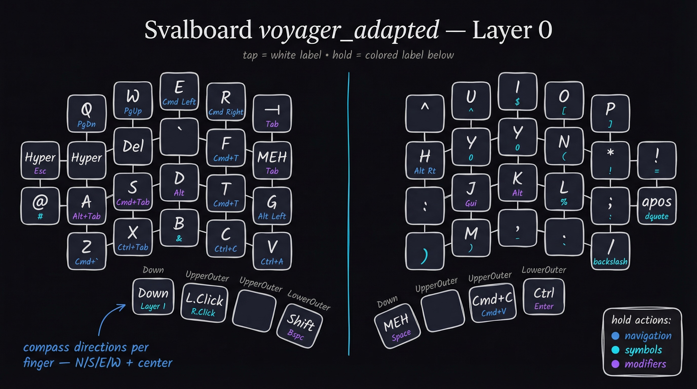

# voyager_adapted keymap for Svalboard

Adapted from the Piantor Pro `voyager_adapted` layout to preserve muscle memory across both keyboards.



## Layer 0 — Alpha

Each finger cluster uses compass directions: **Center** (home row), **North** (top row), **South** (bottom row), **East/West** (lateral tilts). Every key has a **tap** action and a **hold** action.

**Hold color guide:** blue = navigation · cyan = symbols · purple = modifiers

### Left Hand

| Cluster | Center | North | South | East | West |
|---------|--------|-------|-------|------|------|
| L1 index | F *(Gui)* | R *(Cmd→)* | V *(Ctrl+A)* | G *(Alt←)* | MEH/Tab |
| L2 middle | D *(Alt)* | E *(Cmd←)* | C *(Ctrl+C)* | T *(Cmd+T)* | `` ` `` |
| L3 ring | S *(Cmd+Tab)* | W *(PgUp)* | X *(Ctrl+Tab)* | B *(&)* | Delete |
| L4 pinky | A *(Alt+Tab)* | Q *(PgDn)* | Z *(Cmd+`)* | @ *(#)* | Hyper/Esc |

**Left thumb:** `Layer 1` (Down) · `LClick/RClick` (UpperOuter) · `Shift/Bspc` (LowerOuter)

### Right Hand

| Cluster | Center | North | South | East | West |
|---------|--------|-------|-------|------|------|
| R1 index | J *(Gui)* | U *(^)* | M *())* | : | H *(Alt→)* |
| R2 middle | K *(Alt)* | I *($)* | , *(-)* | : | Y *(0)* |
| R3 ring | L *(%)* | O *([)* | . *(`)* | = *(+)* | N *(() * |
| R4 pinky | ; *(:)* | P *([)* | / *(\)* | ' *(")* | * *(!)* |

**Right thumb:** `MEH/Space` (Down) · `Cmd+C/Cmd+V` (UpperOuter) · `Ctrl/Enter` (LowerOuter)

---

## Other Layers

| Layer | Access | Purpose |
|-------|--------|---------|
| 1 | LT Down | Navigation / Mouse |
| 2 | LT Down (from L1) | Numbers / Media |
| 3 | R4 West (from L1) | Symbols / Browser |

## Building & Flashing

```bash
# Build both halves
PATH="/opt/homebrew/opt/arm-none-eabi-gcc@8/bin:/opt/homebrew/opt/arm-none-eabi-binutils/bin:/opt/homebrew/bin:/usr/bin:/bin:/Users/jon/.local/bin" \
  make svalboard/left:voyager_adapted svalboard/trackball/pmw3360/right:voyager_adapted

# Flash: unplug → hold reset → plug in → RPI-RP2 mounts → copy .uf2
cp svalboard_left_voyager_adapted.uf2 /Volumes/RPI-RP2/
cp svalboard_trackball_pmw3360_right_voyager_adapted.uf2 /Volumes/RPI-RP2/
```
